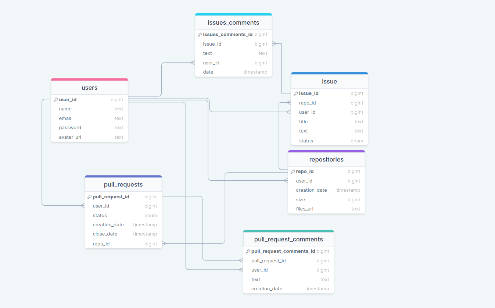
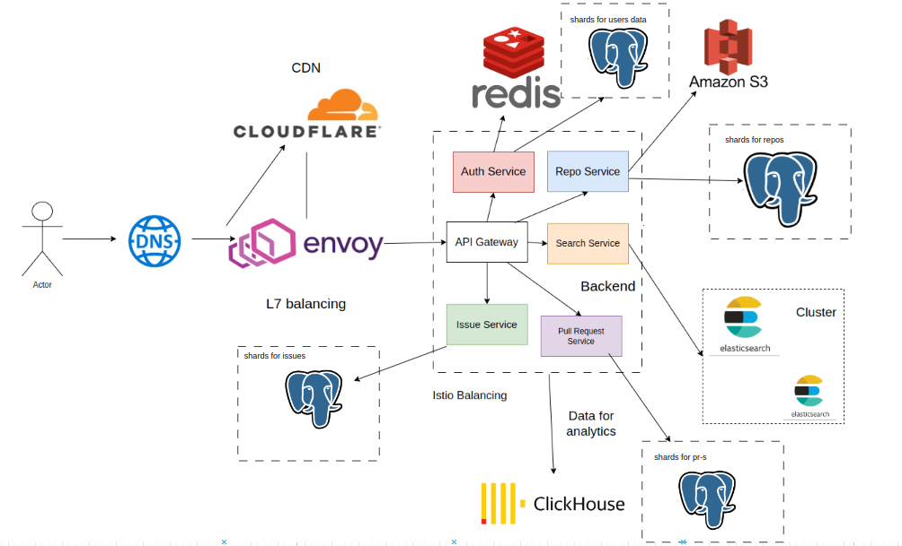

# Github

## 1. Тема и целевая аудитория

**Github** — платформа и облачный сервис для разработки программного обеспечения и контроля версий с использованием Git,
позволяющий разработчикам хранить свой код и управлять им.

### MVP

- Работа с репозиторием(создание, клонирование, загрузка новых данных из репозитория, редактирование)
- Комментарии к Pull Request: создание, редактирование и удаление
- Открытие и закрытие Pull Request
- Открытие и закрытие Issues

### Целевая аудитория

Согласно [информации с официального сайта](https://github.com/about) и [hypestat](https://hypestat.com/info/github.com):

- 100+ миллионов активных (зарегистрированных) пользователей
- 412 миллиона посещений в месяц
- 13.6 миллионов пользователей в день

#### Географическое распространение

| Страна   | Процент пользователей от общего числа |
|----------|:-------------------------------------:|
| США      |                 16.58                 |
| Китай    |                 12.37                 |
| Индия    |                 9.04                  |
| Япония   |                 3.98                  |
| Германия |                 3.62                  |

----------------------------------------------------------------------


## 2. Расчет нагрузки

### Продуктовые метрики

Согласно [hypestat](https://hypestat.com/info/github.com) количество уникальных пользователей в день составляет около
**13.6M** (DAU).
Месячная аудитория составляет **73M** активных пользователей (MAU).

Исходя из [информации с официального сайта,](https://github.com/about) на платформе создано более 330M
репозиториев. Учитывая, что в 2022 количество новых репозиториев составило 85.7M, то количество репозитореев составляет
примерно **~420M**. Тогда каждый пользователь в среднем имеет `420M /100M = 4.2`, то есть в среднем **4** репозитория на
одного пользователя.
Средний размер репозитория на GitHub может варьироваться в зависимости от типа проекта и содержимого. Однако, в целом,
многие репозитории на GitHub имеют размер от нескольких десятков килобайт до нескольких гигабайт, но большинство
значений попадает в диапазон `1М—30 Мб`.
Поэтому в качетве среднего значения возьмём **15 Мб**.

Пользователь создаёт **~2** Pull Requests в неделю, исходя из большинства открытых репозиториев на github, в среднем в
репозитории 5 Pull Requests, тогда учитывая, что один Pull Request занимает примерно **1 Кб**, в репозитории Pull
Requests занимают **~5 Кб**.

В результате опроса знакомых и анализа открытых репозиториев было выявлено, что в одном репозитории около 15
комментариев, а средняя длина комментария 100 символов ~ **1.47 Кб**.

По личному опыту и опросу знакомых, один пользователь создает около **2** Issues в месяц, а каждый
репозиторий имеет в среднем **5** Issues, предположим, что 1 Issue это 256 байт, тогда в репозитории они будут занимать
около **1.25 Кб**.

Получаем средний размер хранилища пользователя:

```
(15 * 4) Мб + 5 Кб + 1.25 Кб + 1.47 Кб = 60 Мб
```

#### Среднее количество действий пользователя по типам:

| Тип действия                         | Количество/период |
|--------------------------------------|:-----------------:|
| Создание репозитория                 |     1 в месяц     |
| Клонирование репозитория             |     2 в месяц     |
| Загрузка новых данных из репозитория |     3 в день      |
| Редактирование репозитория           |     5 в день      |
| Открытие Pull Request                |    2 в неделю     |
| Просмотр Pull Request                |     2 в день      |
| Добавление комментария               |     2 в день      |
| Просмотр комментариев                |     2 в день      |
| Открытие Issue                       |     1 в месяц     |
| Просмотр Issue                       |     1 в день      |

### Технические метрики

#### Хранилище

- Репозитории: `420М * 15 МБ = 6300 Тб`
- Pull Requests: `420М * 5 Кб = 2.1 Тб`
- Issues: `420М * 1.25 Кб = 525 Гб`
- Комментарии: `420М * 1.47 Кб = 617.4 Гб`

#### Сетевой трафик и rps

Так как количество уникальных пользователей в
день составляет 13.6M, то в качестве дневной аудитории возьмём **40M**, так как часть пользователей посещает сервис
несколько раз в течение дня.

Согласно [hypestat](https://hypestat.com/info/github.com), пользователь в среднем посещает 6.69 страниц в день, округлим
это число до **7** страниц в день.
На стороне клиента в загруженном JS действует механизм кэширования и при повторном переходе на страницу, она не
загружается с сервера или же используются другие механизмы оптимизации. Таким образом, фактических отдач страниц с
сервера может быть не 7, а меньше. Для простоты будем считать, что 7 посещаемых страниц - это фактически полноценная
отдача данных без механизмов кэширования (рассматриваем худший для сервиса
сценарий).

Будем предполагать, что из 7 страниц:

- стартовая страница
- страница со списком репозиториев пользователя
- 2 страницы кода выбранного репозитория
- страница с Pull Requests
- страница Issues
- страница профиля пользователя

Используя. "инструменты разработчика" в браузере мы можем примерно рассчитать размер .html, .js и .css файлов для
отрисовки каждой из страниц и количество запросов для их получения, в качестве данных возьмём средний результат
знакомых:

| Страница                         | Размер в Кб | Кол-во запросов |
|----------------------------------|-------------|-----------------|
| стартовая страница               | 742         | 71              |
| список репозиториев пользователя | 793         | 87              |
| код репозитория                  | 783         | 90              |
| Pull Requests                    | 620         | 71              |
| Issues                           | 611         | 68              |
| профиль пользователя             | 740         | 74              |

Получаем средний размер трафика и запросов для **статики на одного пользователя в день**:

```azure
Трафик: 742 + 793 + 783*2 + 620 + 611 + 740 = 4.9 Мб
Кол-во
запросов: 71 + 87 + 90*2 + 71 + 68 + 74 = 551
```

Тогда учитывая количество пользователей, получаем:

```azure
Трафик: 4.9 Мб * 40М / 86 400 = 2.2 Гб/c
RPS: 551 * 40М / 86 400 = 255 000
```

Для статических ресурсов мы предполагаем использование CDN (Content Delivery Network), чтобы обеспечить масштабируемость
и быструю доставку контента. Поэтому объем трафика и количество запросов в секунду (RPS) для статики будут
обрабатываться и обслуживаться CDN, а мы можем учитывать только получение динамического контента и продуктовые запросы
для нашего сервиса.

Рассмотрим запросы из продуктовых требований для расчёта сетевой нагрузки. Для рассчёта RPS используем формулу:

```azure
 <дневная аудитория> * <средняя частота выполнения данного запроса в сутки одним пользователем> / 86 400(кол-во секунд в сутках)
```

Для рассчёта трафика:

```azure
<средний объём данных переданных по сети для данного типа запроса> * RPS
```

1. Создание репозитория

```
RPS: 40М / 86 400 / 30 = 15.43
Трафик: 3.9 * 15.43 = 60.2 Кб/с 
```

2. Клонирование репозитория

```
RPS: 40М / 86 400 * 2 / 30 = 30.9
Трафик: 15360 * 30.9 = 0,47 Гб/с 
```

3. Загрузка новых данных из репозитория (git pull)

```
RPS: 40М / 86 400 * 3 = 1389
Трафик: 3.6 * 1389 = 5 Мб/с 
```

4. Редактирование репозитория

```
RPS: 40М / 86 400 * 5 = 2315
Трафик: 3.3 * 2315 = 7.6 Мб/с 
```

5. Открытие Pull Request

```
RPS: 40М / 86 400 * 2/7 = 132.3
Трафик: 3.4 * 132.3 = 0.5 Мб/с 
```

6. Просмотр Pull Request

```
RPS: 40М / 86 400 * 2 = 926
Трафик: 50 * 926 = 46.3 Мб/с 
```

7. Добавление комментария

```
RPS: 40М / 86 400 * 2 = 926
Трафик: 19 * 926 = 17.6 Мб/с
```

8. Просмотр комментариев

```
RPS: 40М / 86 400 * 2 = 926
Трафик: 90 * 926 = 83.34 Мб/с 
```

9. Открытие Issues

```
RPS: 40М / 86 400 / 30 = 15.43
Трафик: 3.3 * 15.43 = 51 Кб/с 
```

10. Просмотр Issues

```
RPS: 40М / 86 400 = 463
Трафик: 37 * 463 = 16.72 Мб/с 
```

10. Поиск

```
RPS: 40М / 86 400 = 463
Трафик: 0,11 * 463 = 50 Мб/с 
```

#### В итоге

| Запрос                                          |  RPS  |   Трафик   |   
|-------------------------------------------------|:-----:|:----------:|
| Создание репозитория                            | 15.43 | 60.2  Кб/с |
| Клонирование репозитория                        | 30.9  | 0,47 Гб/с  |
| Загрузка новых данных из репозитория (git pull) | 1389  |   5 Мб/с   |
| Редактирование репозитория                      | 2315  |  7.6 Мб/с  |
| Открытие Pull Request                           | 132.3 |  0.5 Мб/с  |
| Просмотр Pull Request                           |  926  | 46.3  Мб/с |
| Добавление комментария                          |  926  | 17.6 Мб/с  |
| Просмотр комментариев                           |  926  | 83.34 Мб/с |
| Открытие Issues                                 | 15.43 |  51  Кб/с  |
| Просмотр Issues                                 |  463  | 16.72 Мб/с |
| Поиск                                           |  463  |  50 Мб/с   |
| **Общие значения**                              | 7602  | 0.58 Гб/с  |
| **При пиковой нагрузке, х2**                    | 15204 | 1.16 Гб/с  |

## Глобальная балансировка

### Расположение датацентров

Поскольку GitHub нацелен в первую очередь на глобальный рынок, серверы будут размещаться в разных странах для
обеспечения лучшего подключения.

Если мы рассмотрим плотность пользователей GitHub по регионам, то можно сказать, что большая часть активных
пользователей находится в Северной Америке и Европе. Исходя из этого, большее число арендуемых датацентров должны быть
размещены ближе к этим регионам, чтобы обеспечить быстрый доступ и низкую задержку.
В Европе можно рассмотреть аренду датацентра у провайдеров, таких как Digital Realty или Equinix.
У Digital Realty есть несколько датацентров в Европе, включая Лондон, Амстердам и Франкфурт.
У Equinix также есть несколько датацентров в Европе, включая Лондон, Париж и Франкфурт.
В Северной Америке можно рассмотреть аренду датацентра у провайдеров, таких как Amazon Web Services (AWS) или Microsoft
Azure.

Арендуем по одному датацентру во **Франкфурте (Европа)**, **Вирджинии (Северная Америка)** и **Калифорнии (Северная
Америка)**, чтобы обеспечить покрытие основных регионов с наибольшей аудиторией.

Кроме того, учитывая востребованность GitHub в Азиатско-Тихоокеанском регионе, можно арендовать один датацентр в Японии
и два в Южной
Корее для обеспечения более быстрого доступа и удовлетворения потребностей пользователей в этой части мира.

### Балансировка

Для обеспечения эффективной балансировки нагрузки и доставки контента в разных регионах, мы можем использовать
комбинацию Geo-DNS и CDN (Content Delivery Network).
Разместим DNS-серверы в основных регионах(Северная Америка, Европа, Азия) по крайней мере 2-3 DNS-сервера в каждом
регионе для обеспечения высокой доступности и отказоустойчивость.
Такое количество позволит балансировать нагрузку и обеспечивать резервирование в случае сбоев.
CDN-сервера расположим в точках IX, а также регионах указанных выше.

## Локальная балансировка

Для раздачи статики будет использоваться **CDN**(например, Cloudflare). Для контейниризации сервиса будет использован
kubernetes.
Также настроим **VRRP** на маршрутизаторах в каждом датацентре. VRRP позволяет создать виртуальный IP-адрес, который
будет обслуживаться несколькими реальными маршрутизаторами. В случае отказа одного маршрутизатора, другой маршрутизатор
автоматически берет на себя обработку трафика.

Для балансировки трафика внутри датацентра будут использоваться **L7 балансировщики** - **Envoy**, так как он удобно
кастомизируется и имеет хорошую производительность, а статику будет разадавать CDN, плюс есть возможность динамической
конфигурации и мониторинга, кроме того envoy позволяет осуществить service mesh для балансировки между контейнерами(
например, Istio).

## Логическая схема



### Примерный размер данных:

Users:

```postgresql
    8
    (bigint)
    + 44(name) + 54(email) + 64(password) + 104(avatar_url) = 274 байта
    274 * 100M(кол-во пользователей) = 27.4 Гб
```

Pull_requests:

```postgresql
    3 * 8(bigint) + 2 * 8(timestamp) + 63(enum) = 103 байт
    103 * 2100M(420М репозиториев, в среднем 5 pull-requests в репозитории) = 216.3 Гб
```

Issue:

```postgresql
    3 * 8(bigint) + 63(enum) + 64(title) + 504(text) = 655 байт
    655 * 2100M(420М репозиториев, в среднем 5 issue в репозитории) = 137,5 Тб
```

Repositories:

```postgresql
    3 * 8(bigint) + 8(timestamp) + 154(files_url) = 186 байт
    186 * 420М = 78,12 Гб
```

Pull_request_comments

```postgresql
    3 * 8(bigint) + 8(timestamp) + 104(text) = 136 байт
    136 * 10500М(420М репозиториев, в среднем 5 pull-requests в репозитории и 5 комментариев к pull-requests) = 1.43 Тб
```

Issues_comments:

```postgresql
    3 * 8(bigint) + 8(timestamp) +  104(text: 100 символов + 4 байта для хранения длины в postgres) = 136 байт
    136 * 4200M(420М репозиториев, в среднем 5 issue в репозитории и 2 комметария к Issues) = 571.2 Гб
```

## Физическая схема

### Выбор СУБД


### Индексы

Hash-индексы по FK для repositories(user_id), issues(repo_id), pull_requests(repo_id), issues_comments(issue_id),
pull_request_comments(pull_request_id) для ускорения select запросов.

B-tree индекс для (repo_id, creation_date) у pull_request и issue, чтобы ускорить сортировку, также индекс для таблицы
repo_view для поля view_url, чтобы ускорить работу group by.

### Шардинг

В качестве ключа для шардинга используются id(PK), на картинке приведены id для шардинга каждой таблицы.
Для шардинга файлов можно использовать хэш, так как git контентно-адресуемое хранилище данных.

### Клиентские библиотеки / интеграции

Язык бэкенда - Go, поэтому в качестве библиотек были выбраны:

- Postgres - [pgx](https://github.com/jackc/pgx)
- Redis - [официальный драйвер](https://github.com/redis/go-redis)
- Amazon s3 - [AWS SDK](https://pkg.go.dev/github.com/aws/aws-sdk-go)

## Распределенные алгоритмы

Для поиска по коду, коммитам, пул реквестам и репозиториям можно использовать **Elasticsearch** - мощный и гибкий
поисковый и аналитический движок, предназначенный для обработки и анализа больших объемов данных. Elasticsearch
позволяет GitHub быстро и эффективно осуществлять поиск, фильтрацию и анализ данных.
Кроме того, Elasticsearch легко масштабируется горизонтально путем добавления новых узлов в кластер.

## Технологии

| Технология        |                  Область применения                   |                                                    Мотивация                                                     |
|-------------------|:-----------------------------------------------------:|:----------------------------------------------------------------------------------------------------------------:|
| Typescript, React |                       Frontend                        | Быстро развиваются, большое коммьюнити, надежность, хорошо задокументированы, легко найти специалистов в команду |
| Cloudflare        |                        Network                        |                         Универсальный: CDN, DNS, файервол сервис для защиты от DDos-атак                         |
| Envoy             |                     Load balancer                     |             Большое коммьюнити, предоставляет различные метрики, удобство при работе с контейнерами              |
| Golang            |                        Backend                        |                      Быстрый, производительный, удобен для rpc и микросервисной архитектуры                      |
| PostgreSQL        |                       Database                        |                                                Высокая надежность                                                |
| Elastic Search    | Поиск по репозиториям, коду, коммитам, пулл реквестам |                                          Быстрый, удобно масштабируется                                          |
| Redis             |           хранение пользовательских сессий            |                               Удобный, быстрый, наиболее популярен для этой задачи                               |
| Clickhouse        |         Хранение данных для аналитики, логов          |                                   Очень удобен для аналитики, довольно быстрый                                   |

## Архитектура



## Надёжность

Kubernetes и Istio позволяют равномерно распределять нагрузку между различными экземплярами микросервисов, чтобы
предотвратить перегрузку и обеспечить стабильность работы, в случае падения контейнеров, сработает автоматический
рестарт, также автоскейлинг кубера позволит обеспечить практически мгновенное горизонтальное масштабирование. Так как все сервисы - stateless поды, то перезапуск и реплицирование обезопасят от даунтайма.

Для БД - использование реплицирования и шардирования обеспечивают отказоустойчивость при многочисленных транзакциях на
чтение / запись, также необходимы резервное копирование и снапшоты для возможности восстановления.

Постоянный мониторинг состояний сервисов с помощью графиков в графане и настройке алёртов в случае пика нагрузки или
падения большого числа запросов / нод.

Для датацентров - несколько провайдеров и дц в разных городах.

## Расчёт ресурсов

- Сервисы в k8s

| Сервис        | Целевая пиковая нагрузка, RPS | CPU | RAM    | Net         |
|---------------|-------------------------------|-----|--------|-------------|
| Auth          | 14300                         | 14  | 4 Gb   | 1.16 Gbit/s |
| Search        | 463                           | 8   | 50 Gb  | 50 Mbit/s   |
| Repo          | 3750                          | 3   | 1 Gb   | 0.5 Gbit/s  |
| Issue         | 1404                          | 2   | 1 Gb   | 0.1 Gbit/s  |
| Pull requests | 1984                          | 2   | 1 Gb   | 0.15 Gbit/s |

Так как через сервис авторизации проходит множество запросов, его развернем на более мощных серверах.
Согласно [рекомендациям](https://opster.com/guides/elasticsearch/capacity-planning/elasticsearch-hardware-requirements/#:~:text=As%20a%20general%20guideline%2C%20it,or%20more%20RAM%20per%20node.) для elastic search на каждую ноду рекомендуется 2 ядра и 16 GB RAM, для рассчёта используем 3 ноды. 

| Сервис | Хостинг | Конфигурация                      | Cores | Cnt | Покупка | Аренда/Амортизация |
|--------|---------|-----------------------------------|-------|-----|---------|--------------------|
| Envoy  | own     | 2x6430/4x8GB/1xNVMe128Gb/2x10Gb/s | 64    | 4   | $9 000  | $155               |
| Auth   | own     | 2x6430/4x8GB/1xNVMe256Gb/2x10Gb/s | 64    | 3   | $9 000  | $167               |
| Другие | own     | 1x6434/4x4GB/1xNVMe256Gb/2x1Gb/s  | 8     | 24  | $6 000  | $80                |

## Источники

1. https://github.com/about
2. https://hypestat.com/info/github.com
3. https://octoverse.github.com/
4. https://pkg.go.dev/github.com/aws/aws-sdk-go
5. https://github.com/redis/go-redis
6. https://github.com/jackc/pgx
7. https://www.elastic.co/customers/github
8. https://github.com/init/highload/blob/main/highload_l11_hosting.md
9. https://opster.com/guides/elasticsearch/capacity-planning/elasticsearch-hardware-requirements/#:~:text=As%20a%20general%20guideline%2C%20it,or%20more%20RAM%20per%20node.
